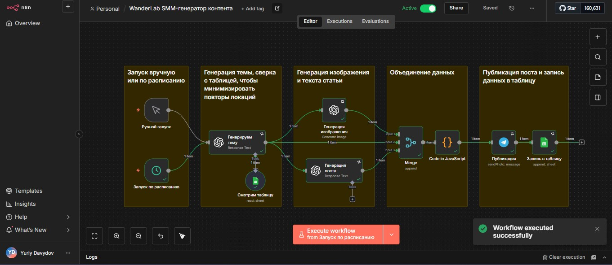

# 🌍 WanderLab SMM-генератор контента

Автоматизированная система для создания и публикации контента о путешествиях в Telegram-канал с использованием AI.

🔗 **Канал с результатами:** [t.me/wander_lab](https://t.me/wander_lab)

[](https://n8n.io/)
[](https://openai.com/)
[](https://openai.com/dall-e-3)
[](https://telegram.org/)

---

## 📋 Что делает система

**Автоматически создаёт контент для Telegram-канала:**
- 🎯 Генерирует уникальные темы статей о путешествиях
- 📝 Пишет информативные тексты (500-800 слов) через GPT-4
- 🎨 Создаёт профессиональные иллюстрации через DALL-E 3 в стиле National Geographic
- 🔍 Проверяет повторы локаций через Google Sheets
- 📤 Публикует готовые посты в Telegram автоматически
- 🛡️ Мониторит ошибки и отправляет уведомления

**Результат:** полная автоматизация SMM — от идеи до публикации без участия человека.

---

## 🏗 Архитектура


### Основной воркфлоу (9 узлов):

```
Trigger → Проверка истории (Google Sheets)
    ↓
Генерация темы (GPT-4)
    ↓
┌─────────────────┴─────────────────┐
│                                   │
Генерация текста (GPT-4)    Генерация изображения (DALL-E 3)
│                                   │
└─────────────────┬─────────────────┘
    ↓
Объединение данных
    ↓
Форматирование (JavaScript)
    ↓
Публикация в Telegram
    ↓
Сохранение в Google Sheets
```

### Error воркфлоу (2 узла):

```
Error Trigger → Уведомление в Telegram
```

**Обработка ошибок:**
- Retry On Fail: 3 попытки для всех API узлов
- Автоматические уведомления при сбоях
- Защита от rate limits и таймаутов

---

## 🎨 Примеры результатов



**Сгенерированные темы:**
- Неизведанные тропы Патагонии пешком
- Гастротур по Тбилиси за выходные
- Тайные пляжи Кипра для отдыха летом
- Экспедиция к вулканам Камчатки летом

**Качество:**
- Уникальные темы без повторов
- Профессиональные фото в documentary-style
- Вовлекающий текст оптимальной длины
- Стабильное качество благодаря промпт-инжинирингу

---

## 🛠 Технологии

| Компонент | Технология | Назначение |
|-----------|-----------|------------|
| Автоматизация | N8N | Оркестрация воркфлоу |
| Генерация текстов | OpenAI GPT-4 | Создание статей |
| Генерация изображений | DALL-E 3 | Профессиональные фото |
| Публикация | Telegram Bot API | Отправка в канал |
| База данных | Google Sheets | История и контроль повторов |
| Мониторинг | Error Trigger + Telegram | Уведомления об ошибках |

---

## 🚀 Быстрый старт

### Требования:
- N8N (self-hosted или cloud)
- OpenAI API key
- Telegram Bot Token
- Google Sheets API credentials

### Установка:

1. **Импортируй воркфлоу в N8N:**
   - Открой N8N
   - Import from File → выбери `WanderLab_workflow.json`

2. **Настрой credentials:**
   - OpenAI API (для GPT-4 и DALL-E 3)
   - Telegram Bot (создай через @BotFather)
   - Google Sheets (включи API и получи credentials)

3. **Настрой параметры:**
   - В узле Google Sheets: укажи ID своей таблицы
   - В узле Telegram: укажи chat_id своего канала
   - Проверь промпты в узлах OpenAI

4. **Создай Google Sheets таблицу:**
   - Колонки: `Дата | Тема | Локация | message_id`
   - Дай доступ сервисному аккаунту Google

5. **Настрой Error воркфлоу:**
   - Импортируй отдельный воркфлоу для мониторинга
   - Укажи свой личный chat_id для уведомлений

6. **Запусти:**
   - Тестовый запуск вручную
   - Настрой Cron для автоматических публикаций

---

## 🛡️ Обработка ошибок

### Формат уведомления:
```
🚨 Остановка Workflow
📋 Workflow: WanderLab SMM-генератор
📍 Нода: Генерация изображения
❌ Ошибка: Bad Request: invalid parameters
```

### Retry механизм:
- **OpenAI узлы:** 3 попытки с интервалом 1-2 сек
- **Telegram:** 3 попытки с интервалом 1 сек
- **Google Sheets:** 3 попытки с интервалом 1 сек

### Защита от:
- Временных сбоев сети
- Rate limits API
- Таймаутов запросов
- Перегрузок серверов

---

## 📊 Статистика проекта

- **Время разработки:** 2 дня
- **Узлов в воркфлоу:** 9 (основной) + 2 (error)
- **API интеграций:** 4
- **Строк кода:** ~500
- **Статус:** Production ready

---

## 💡 Промпт для DALL-E 3

Универсальный промпт для стабильного качества изображений:

```
Professional travel photography: {{ topic }}. 
Natural documentary style, cinematic composition, 
realistic muted colors, no text overlays, 
landscape focus, National Geographic aesthetic.
```

**Ключевые принципы:**
- Документальный стиль, не постановочный
- Естественное освещение
- Приглушённые реалистичные цвета
- Фокус на ландшафте, не на людях
- Качество National Geographic

---

## 🎯 Применение в других нишах

Система легко адаптируется под другие направления:

**Кулинария:** рецепты с аппетитными фото  
**Фитнес:** программы тренировок с визуализацией  
**Образование:** обучающий контент с иллюстрациями  
**Недвижимость:** обзоры локаций с профессиональными фото  
**Мода:** луки и тренды с визуализацией  

Для адаптации нужно только изменить промпты и настроить Google Sheets под специфику ниши.

---

## 📈 Планы развития

**Краткосрочные (1-2 недели):**
- Аналитика просмотров и реакций через Telegram API
- Система контент-планирования с накоплением постов

**Среднесрочные (1-2 месяца):**
- A/B тестирование разных форматов контента
- Кросс-постинг в VK, Instagram
- Мультиязычность

**Долгосрочные (3+ месяца):**
- SaaS платформа для блогеров
- Web-интерфейс для управления
- Marketplace промптов и шаблонов

---

## 📄 Лицензия

MIT License - свободное использование и модификация

---

## 👤 Автор

Разработано в рамках курса по промпт-инжинирингу и AI-автоматизации.

**Контакты:**
- Telegram: [@yurydavydov](https://t.me/yurydavydov)
- Канал проекта: [t.me/wander_lab](https://t.me/wander_lab)

---

## ⭐ Если проект полезен

Поставь звезду на GitHub и подпишись на канал, чтобы увидеть систему в действии!

**Дата создания:** Декабрь 2024  
**Версия:** 1.0  
**Статус:** ✅ Production Ready
